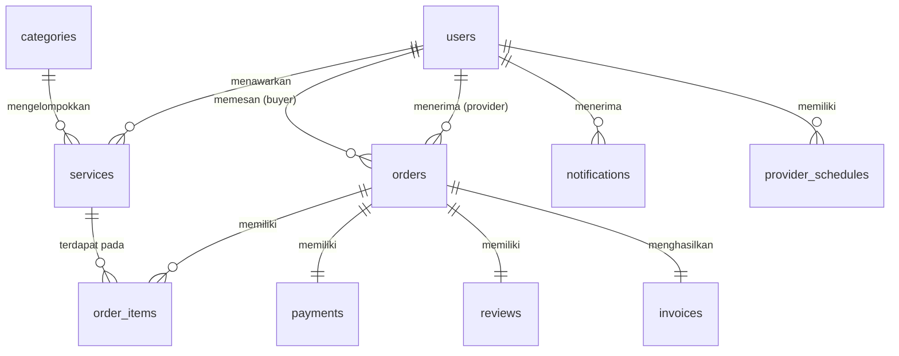

# Skema Basis Data (Database Schema) - BisaBantu

* **Nama Basis Data**: `bisabantu`
* **Mesin Penyimpanan (Storage Engine)**: InnoDB
* **Karakter Set (Charset)**: `utf8mb4_general_ci`

---

## 📊 Entity Relationship Diagram (ERD)

Berikut adalah visualisasi hubungan antartabel di dalam database `bisabantu`:

---

## 🗂️ Detail Tabel Database

### 1. `users`
Menyimpan semua akun pengguna sistem (Pembeli, Penyedia Jasa, dan Administrator).

| Nama Kolom | Tipe Data | Nullable | Keterangan |
|---|---|---|---|
| `id` | `INT(11) AUTO_INCREMENT` | `NO` | **PRIMARY KEY** |
| `name` | `VARCHAR(100)` | `NO` | Nama lengkap pengguna |
| `email` | `VARCHAR(100)` | `NO` | Alamat email unik (digunakan untuk login) |
| `password` | `VARCHAR(255)` | `NO` | Password terenkripsi menggunakan hash Bcrypt |
| `role` | `ENUM('buyer','provider','admin')` | `NO` | Hak akses pengguna |
| `is_verified` | `TINYINT(1)` | `YES` | Khusus penyedia jasa: `1` jika sudah diverifikasi admin, `0` jika belum |
| `phone` | `VARCHAR(20)` | `YES` | Nomor telepon kontak aktif |
| `address` | `TEXT` | `YES` | Alamat tempat tinggal |
| `remember_token`| `VARCHAR(255)` | `YES` | Token otentikasi sesi persisten (Remember Me) |
| `created_at` | `TIMESTAMP` | `NO` | Tanggal pendaftaran akun (default `CURRENT_TIMESTAMP`) |
| `updated_at` | `TIMESTAMP` | `NO` | Waktu pembaharuan terakhir data akun |

* **Kunci Unik (Unique Key)**: `email`

---

### 2. `categories`
Menyimpan kategori layanan jasa yang disediakan di platform.

| Nama Kolom | Tipe Data | Nullable | Keterangan |
|---|---|---|---|
| `id` | `INT(11) AUTO_INCREMENT` | `NO` | **PRIMARY KEY** |
| `name` | `VARCHAR(50)` | `NO` | Nama kategori (misal: Bersih-bersih, Les Privat, dll) |
| `description` | `TEXT` | `YES` | Deskripsi singkat mengenai kategori tersebut |
| `created_at` | `TIMESTAMP` | `NO` | Waktu kategori ditambahkan (default `CURRENT_TIMESTAMP`) |

---

### 3. `services`
Menyimpan detail jasa/layanan yang ditawarkan oleh Penyedia Jasa (Provider).

| Nama Kolom | Tipe Data | Nullable | Keterangan |
|---|---|---|---|
| `id` | `INT(11) AUTO_INCREMENT` | `NO` | **PRIMARY KEY** |
| `provider_id` | `INT(11)` | `NO` | **FOREIGN KEY** merujuk ke `users(id)` |
| `category_id` | `INT(11)` | `NO` | **FOREIGN KEY** merujuk ke `categories(id)` |
| `title` | `VARCHAR(200)` | `NO` | Judul atau nama layanan jasa |
| `description` | `TEXT` | `NO` | Deskripsi lengkap penawaran layanan |
| `price` | `DECIMAL(12,2)` | `NO` | Harga dasar per unit layanan |
| `price_unit` | `VARCHAR(20)` | `YES` | Satuan unit (default: `'per unit'`, jam, kunjungan, kg, dll) |
| `estimated_duration`| `VARCHAR(50)` | `YES` | Estimasi lama pengerjaan (misal: `"1-2 jam"`, `"2 hari"`) |
| `location` | `VARCHAR(255)` | `NO` | Area jangkauan layanan (kota/kecamatan) |
| `image` | `VARCHAR(255)` | `YES` | Nama file gambar sampel layanan |
| `is_active` | `TINYINT(1)` | `YES` | Status keaktifan iklan jasa (`1` = Aktif, `0` = Nonaktif) |
| `created_at` | `TIMESTAMP` | `NO` | Waktu jasa dibuat |
| `updated_at` | `TIMESTAMP` | `NO` | Waktu pembaharuan terakhir data jasa |

* **Relasi & Constraint**:
  * `provider_id` -> `users(id)` ON DELETE CASCADE
  * `category_id` -> `categories(id)` ON DELETE RESTRICT

---

### 4. `orders`
Menyimpan data ringkasan transaksi pesanan jasa dari pembeli.

| Nama Kolom | Tipe Data | Nullable | Keterangan |
|---|---|---|---|
| `id` | `INT(11) AUTO_INCREMENT` | `NO` | **PRIMARY KEY** |
| `buyer_id` | `INT(11)` | `NO` | **FOREIGN KEY** merujuk ke `users(id)` (Pembeli) |
| `provider_id` | `INT(11)` | `NO` | **FOREIGN KEY** merujuk ke `users(id)` (Penyedia Jasa) |
| `order_number` | `VARCHAR(20)` | `NO` | Nomor Invoice Unik (format: `ORD` + tanggal + urutan) |
| `total_price` | `DECIMAL(12,2)` | `NO` | Akumulasi total harga pesanan |
| `quantity` | `INT(11)` | `NO` | Jumlah unit jasa yang dipesan |
| `service_date` | `DATE` | `NO` | Tanggal rencana pengerjaan/kunjungan |
| `service_address`| `TEXT` | `NO` | Lokasi spesifik pengerjaan jasa |
| `status` | `ENUM(...)` | `NO` | Status pesanan (`pending`, `waiting_payment`, `paid`, `accepted`, `in_progress`, `completed`, `cancelled`) |
| `notes` | `TEXT` | `YES` | Instruksi tambahan dari pembeli |
| `created_at` | `TIMESTAMP` | `NO` | Waktu pembuatan transaksi |
| `updated_at` | `TIMESTAMP` | `NO` | Waktu update status transaksi terakhir |

* **Kunci Unik (Unique Key)**: `order_number`
* **Relasi & Constraint**:
  * `buyer_id` -> `users(id)` ON DELETE RESTRICT
  * `provider_id` -> `users(id)` ON DELETE RESTRICT

---

### 5. `order_items`
Menyimpan rincian item jasa yang dibeli per transaksi (mendukung pengembangan masa depan untuk multi-item checkout).

| Nama Kolom | Tipe Data | Nullable | Keterangan |
|---|---|---|---|
| `id` | `INT(11) AUTO_INCREMENT` | `NO` | **PRIMARY KEY** |
| `order_id` | `INT(11)` | `NO` | **FOREIGN KEY** merujuk ke `orders(id)` |
| `service_id` | `INT(11)` | `NO` | **FOREIGN KEY** merujuk ke `services(id)` |
| `quantity` | `INT(11)` | `NO` | Jumlah kuantitas pesanan item |
| `price_per_unit` | `DECIMAL(12,2)` | `NO` | Snapshot harga per unit jasa pada saat transaksi terjadi |

* **Relasi & Constraint**:
  * `order_id` -> `orders(id)` ON DELETE CASCADE
  * `service_id` -> `services(id)` ON DELETE RESTRICT

---

### 6. `payments`
Menyimpan data detail pembayaran beserta bukti transfer untuk pesanan tertentu.

| Nama Kolom | Tipe Data | Nullable | Keterangan |
|---|---|---|---|
| `id` | `INT(11) AUTO_INCREMENT` | `NO` | **PRIMARY KEY** |
| `order_id` | `INT(11)` | `NO` | **FOREIGN KEY** merujuk ke `orders(id)` |
| `method` | `ENUM('bank_transfer','cash')` | `NO` | Metode pembayaran |
| `proof_image` | `VARCHAR(255)` | `YES` | Nama file gambar bukti transfer bank |
| `status` | `ENUM('pending','verified','rejected')` | `YES` | Status validitas pembayaran (default: `'pending'`) |
| `verified_at` | `DATETIME` | `YES` | Waktu admin memverifikasi pembayaran |
| `notes` | `TEXT` | `YES` | Catatan dari admin jika pembayaran ditolak |
| `created_at` | `TIMESTAMP` | `NO` | Waktu unggah bukti pembayaran |

* **Relasi & Constraint**:
  * `order_id` -> `orders(id)` ON DELETE CASCADE

---

### 7. `reviews`
Menyimpan rating dan umpan balik pembeli untuk layanan yang telah selesai.

| Nama Kolom | Tipe Data | Nullable | Keterangan |
|---|---|---|---|
| `id` | `INT(11) AUTO_INCREMENT` | `NO` | **PRIMARY KEY** |
| `service_id` | `INT(11)` | `NO` | **FOREIGN KEY** merujuk ke `services(id)` |
| `order_id` | `INT(11)` | `NO` | **FOREIGN KEY** merujuk ke `orders(id)` |
| `user_id` | `INT(11)` | `NO` | **FOREIGN KEY** merujuk ke `users(id)` (Pembeli) |
| `rating` | `TINYINT(1)` | `NO` | Nilai kepuasan bernilai `1` hingga `5` |
| `comment` | `TEXT` | `YES` | Tanggapan tertulis pembeli |
| `image` | `VARCHAR(255)` | `YES` | Foto hasil pekerjaan |
| `created_at` | `TIMESTAMP` | `NO` | Waktu pemberian ulasan |

* **Kunci Unik (Unique Key)**: `order_id` (membatasi ulasan agar hanya 1 ulasan per order)
* **Relasi & Constraint**:
  * `service_id` -> `services(id)` ON DELETE CASCADE
  * `order_id` -> `orders(id)` ON DELETE CASCADE
  * `user_id` -> `users(id)` ON DELETE CASCADE

---

### 8. `notifications`
Menyimpan pesan notifikasi internal aplikasi bagi seluruh peran pengguna.

| Nama Kolom | Tipe Data | Nullable | Keterangan |
|---|---|---|---|
| `id` | `INT(11) AUTO_INCREMENT` | `NO` | **PRIMARY KEY** |
| `user_id` | `INT(11)` | `NO` | **FOREIGN KEY** merujuk ke `users(id)` |
| `title` | `VARCHAR(100)` | `NO` | Judul notifikasi |
| `message` | `TEXT` | `NO` | Isi detail pesan notifikasi |
| `is_read` | `TINYINT(1)` | `YES` | Status baca (`0` = belum dibaca, `1` = dibaca) |
| `created_at` | `TIMESTAMP` | `NO` | Waktu notifikasi dikirimkan |

* **Relasi & Constraint**:
  * `user_id` -> `users(id)` ON DELETE CASCADE

---

### 9. `invoices`
Menyimpan informasi penomoran invoice pembayaran legal yang digenerate otomatis.

| Nama Kolom | Tipe Data | Nullable | Keterangan |
|---|---|---|---|
| `id` | `INT(11) AUTO_INCREMENT` | `NO` | **PRIMARY KEY** |
| `order_id` | `INT(11)` | `NO` | **FOREIGN KEY** merujuk ke `orders(id)` |
| `invoice_number` | `VARCHAR(20)` | `NO` | Nomor invoice unik (misal: `INV/YYYYMMDD/XXXX`) |
| `pdf_path` | `VARCHAR(255)` | `NO` | Alamat path berkas invoice PDF |
| `generated_at` | `DATETIME` | `NO` | Tanggal dokumen dibuat |

* **Kunci Unik (Unique Key)**: `invoice_number`
* **Relasi & Constraint**:
  * `order_id` -> `orders(id)` ON DELETE CASCADE

---

### 10. `provider_schedules`
Tabel pendukung untuk menyimpan ketersediaan jadwal hari kerja dan jam kerja mitra Penyedia Jasa.

| Nama Kolom | Tipe Data | Nullable | Keterangan |
|---|---|---|---|
| `id` | `INT(11) AUTO_INCREMENT` | `NO` | **PRIMARY KEY** |
| `provider_id` | `INT(11)` | `NO` | **FOREIGN KEY** merujuk ke `users(id)` |
| `day_of_week` | `TINYINT(1)` | `NO` | Indeks Hari (`0` = Senin, `1` = Selasa, ..., `6` = Minggu) |
| `start_time` | `TIME` | `NO` | Waktu jam mulai operasional |
| `end_time` | `TIME` | `NO` | Waktu jam berakhir operasional |
| `is_available` | `TINYINT(1)` | `YES` | Ketersediaan slot (`1` = Buka, `0` = Tutup/Libur) |

* **Relasi & Constraint**:
  * `provider_id` -> `users(id)` ON DELETE CASCADE
