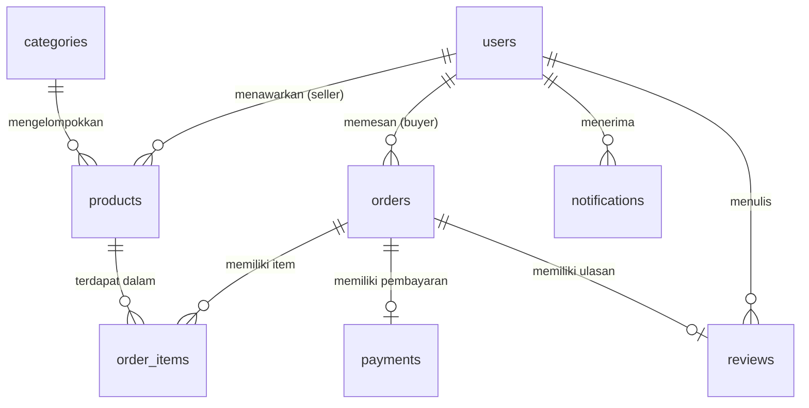

# Database Schema — BisaBantu

- **Nama Database**: `bisabantu`
- **Storage Engine**: InnoDB (mendukung Foreign Key & Transaksi)
- **Charset**: `utf8mb4_general_ci` (mendukung karakter Unicode penuh)
- **Total Tabel**: 8 tabel utama (Minimum Requirement)

---

## 📊 Entity Relationship Diagram (ERD)

---

## 🗂️ Detail Tabel

### 1. `users`
Data pengguna (admin, seller, buyer)

| Kolom | Tipe | Nullable | Keterangan |
|---|---|---|---|
| `id` | `INT AUTO_INCREMENT` | NO | **PRIMARY KEY** |
| `name` | `VARCHAR(100)` | NO | Nama lengkap pengguna |
| `email` | `VARCHAR(100)` | NO | **UNIQUE** — email pengguna |
| `password` | `VARCHAR(255)` | NO | Hash bcrypt |
| `role` | `ENUM('buyer','seller','admin')` | NO | Peran pengguna |
| `created_at` | `TIMESTAMP` | NO | Waktu pendaftaran |

---

### 2. `products`
Data produk (pada platform ini diimplementasikan sebagai penawaran Jasa/Layanan)

| Kolom | Tipe | Nullable | Keterangan |
|---|---|---|---|
| `id` | `INT AUTO_INCREMENT` | NO | **PRIMARY KEY** |
| `seller_id` | `INT` | NO | **FK → users.id** (penyedia/penjual) |
| `category_id` | `INT` | NO | **FK → categories.id** |
| `name` | `VARCHAR(200)` | NO | Nama produk/jasa |
| `description` | `TEXT` | NO | Deskripsi produk/jasa |
| `price` | `DECIMAL(12,2)` | NO | Harga produk/jasa |
| `stock` | `INT` | NO | Ketersediaan slot/stok |
| `image` | `VARCHAR(255)` | YES | Foto/gambar layanan |

---

### 3. `categories`
Kategori produk/jasa

| Kolom | Tipe | Nullable | Keterangan |
|---|---|---|---|
| `id` | `INT AUTO_INCREMENT` | NO | **PRIMARY KEY** |
| `name` | `VARCHAR(50)` | NO | Nama kategori |
| `description` | `TEXT` | YES | Deskripsi singkat kategori |

---

### 4. `orders`
Data pesanan

| Kolom | Tipe | Nullable | Keterangan |
|---|---|---|---|
| `id` | `INT AUTO_INCREMENT` | NO | **PRIMARY KEY** |
| `buyer_id` | `INT` | NO | **FK → users.id** (pembeli) |
| `total_amount` | `DECIMAL(12,2)` | NO | Total pembayaran |
| `status` | `VARCHAR(50)` | NO | Status pesanan |
| `created_at` | `TIMESTAMP` | NO | Waktu pesanan dibuat |

---

### 5. `order_items`
Detail pesanan

| Kolom | Tipe | Nullable | Keterangan |
|---|---|---|---|
| `id` | `INT AUTO_INCREMENT` | NO | **PRIMARY KEY** |
| `order_id` | `INT` | NO | **FK → orders.id** |
| `product_id` | `INT` | NO | **FK → products.id** |
| `quantity` | `INT` | NO | Jumlah/Kuantitas |
| `price` | `DECIMAL(12,2)` | NO | Harga per unit |

---

### 6. `payments`
Data pembayaran

| Kolom | Tipe | Nullable | Keterangan |
|---|---|---|---|
| `id` | `INT AUTO_INCREMENT` | NO | **PRIMARY KEY** |
| `order_id` | `INT` | NO | **FK → orders.id** |
| `payment_method` | `VARCHAR(50)` | NO | Metode pembayaran |
| `proof` | `VARCHAR(255)` | YES | File bukti transfer |
| `status` | `VARCHAR(50)` | YES | Status pembayaran |

---

### 7. `reviews`
Review produk/jasa

| Kolom | Tipe | Nullable | Keterangan |
|---|---|---|---|
| `id` | `INT AUTO_INCREMENT` | NO | **PRIMARY KEY** |
| `product_id` | `INT` | NO | **FK → products.id** |
| `user_id` | `INT` | NO | **FK → users.id** (pembeli) |
| `rating` | `TINYINT` | NO | Skor 1-5 |
| `comment` | `TEXT` | YES | Komentar review |

---

### 8. `notifications`
Notifikasi sistem

| Kolom | Tipe | Nullable | Keterangan |
|---|---|---|---|
| `id` | `INT AUTO_INCREMENT` | NO | **PRIMARY KEY** |
| `user_id` | `INT` | NO | **FK → users.id** |
| `message` | `TEXT` | NO | Isi pesan notifikasi |
| `is_read` | `TINYINT(1)` | YES | Status dibaca |
| `created_at` | `TIMESTAMP` | NO | Waktu dibuat |

---

## 🔗 Ringkasan Relasi Antar Tabel

| Tabel Induk | Tabel Anak | Kolom FK | Behavior |
|---|---|---|---|
| `users` | `products` | `seller_id` | CASCADE DELETE |
| `users` | `orders` | `buyer_id` | RESTRICT |
| `users` | `notifications` | `user_id` | CASCADE DELETE |
| `users` | `reviews` | `user_id` | CASCADE DELETE |
| `categories` | `products` | `category_id` | RESTRICT |
| `products` | `order_items` | `product_id` | RESTRICT |
| `orders` | `order_items` | `order_id` | CASCADE DELETE |
| `orders` | `payments` | `order_id` | CASCADE DELETE |
| `orders` | `reviews` | `order_id` | CASCADE DELETE |
