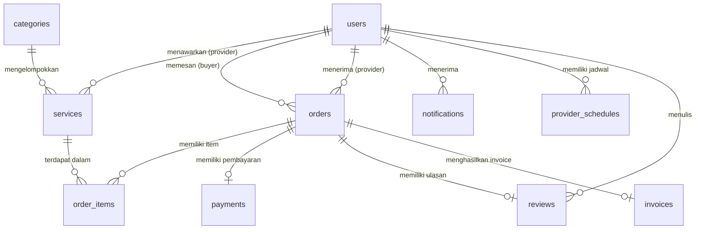

# Database Schema — BisaBantu

- **Nama Database**: `bisabantu`
- **Storage Engine**: InnoDB (mendukung Foreign Key & Transaksi)
- **Charset**: `utf8mb4_general_ci` (mendukung karakter Unicode penuh)
- **Total Tabel**: 10 tabel

---

## 📊 Entity Relationship Diagram (ERD)



---

## 🗂️ Detail Tabel

### 1. `users`
Menyimpan semua akun pengguna: Pembeli, Penyedia Jasa, dan Administrator.

| Kolom | Tipe | Nullable | Keterangan |
|---|---|---|---|
| `id` | `INT AUTO_INCREMENT` | NO | **PRIMARY KEY** |
| `name` | `VARCHAR(100)` | NO | Nama lengkap pengguna |
| `email` | `VARCHAR(100)` | NO | **UNIQUE** — digunakan untuk login |
| `password` | `VARCHAR(255)` | NO | Hash bcrypt dari password |
| `role` | `ENUM('buyer','provider','admin')` | NO | Peran pengguna di platform |
| `is_verified` | `TINYINT(1)` | YES | `1` = aktif/terverifikasi, `0` = pending (khusus provider) |
| `phone` | `VARCHAR(20)` | YES | Nomor telepon |
| `address` | `TEXT` | YES | Alamat pengguna |
| `remember_token` | `VARCHAR(255)` | YES | Token untuk fitur remember me |
| `profile_photo` | `VARCHAR(255)` | YES | Path relatif foto profil |
| `created_at` | `TIMESTAMP` | NO | Waktu registrasi |
| `updated_at` | `TIMESTAMP` | NO | Waktu update terakhir |

---

### 2. `categories`
Kategori jasa yang tersedia di platform (dikelola oleh Admin).

| Kolom | Tipe | Nullable | Keterangan |
|---|---|---|---|
| `id` | `INT AUTO_INCREMENT` | NO | **PRIMARY KEY** |
| `name` | `VARCHAR(50)` | NO | Nama kategori (misal: Bersih-bersih, Perbaikan) |
| `description` | `TEXT` | YES | Deskripsi singkat kategori |
| `created_at` | `TIMESTAMP` | NO | Waktu kategori dibuat |

---

### 3. `services`
Daftar jasa yang ditawarkan oleh Penyedia Jasa.

| Kolom | Tipe | Nullable | Keterangan |
|---|---|---|---|
| `id` | `INT AUTO_INCREMENT` | NO | **PRIMARY KEY** |
| `provider_id` | `INT` | NO | **FK → users.id** (penyedia pemilik jasa) |
| `category_id` | `INT` | NO | **FK → categories.id** |
| `title` | `VARCHAR(200)` | NO | Judul/nama jasa |
| `description` | `TEXT` | NO | Deskripsi lengkap jasa |
| `price` | `DECIMAL(12,2)` | NO | Harga jasa |
| `price_unit` | `VARCHAR(20)` | YES | Satuan harga (per jam, per kunjungan, per kg) |
| `estimated_duration` | `VARCHAR(50)` | YES | Estimasi durasi pengerjaan |
| `location` | `VARCHAR(255)` | NO | Area layanan (kota/kecamatan) |
| `image` | `VARCHAR(255)` | YES | Nama file foto jasa |
| `is_active` | `TINYINT(1)` | YES | `1` = tampil di marketplace, `0` = disembunyikan |
| `created_at` | `TIMESTAMP` | NO | Waktu jasa dibuat |
| `updated_at` | `TIMESTAMP` | NO | Waktu update terakhir |

**Foreign Keys:**
- `provider_id` → `users.id` `ON DELETE CASCADE`
- `category_id` → `categories.id` `ON DELETE RESTRICT`

---

### 4. `provider_schedules`
Jadwal ketersediaan layanan Penyedia Jasa per hari.

| Kolom | Tipe | Nullable | Keterangan |
|---|---|---|---|
| `id` | `INT AUTO_INCREMENT` | NO | **PRIMARY KEY** |
| `provider_id` | `INT` | NO | **FK → users.id** |
| `day_of_week` | `TINYINT(1)` | NO | `0`=Senin, `1`=Selasa, ..., `6`=Minggu |
| `start_time` | `TIME` | NO | Jam mulai layanan |
| `end_time` | `TIME` | NO | Jam selesai layanan |
| `is_available` | `TINYINT(1)` | YES | `1` = tersedia, `0` = libur |

---

### 5. `orders`
Transaksi pesanan antara Pembeli dan Penyedia Jasa.

| Kolom | Tipe | Nullable | Keterangan |
|---|---|---|---|
| `id` | `INT AUTO_INCREMENT` | NO | **PRIMARY KEY** |
| `buyer_id` | `INT` | NO | **FK → users.id** (pembeli) |
| `provider_id` | `INT` | NO | **FK → users.id** (penyedia) |
| `order_number` | `VARCHAR(20)` | NO | **UNIQUE** — kode unik pesanan (misal: ORD20260601xxxx) |
| `total_price` | `DECIMAL(12,2)` | NO | Total harga pesanan |
| `quantity` | `INT` | NO | Total jumlah item |
| `service_date` | `DATE` | NO | **Tanggal pelaksanaan jasa** (digunakan sebagai acuan grafik laporan) |
| `service_address` | `TEXT` | NO | Alamat lokasi pelaksanaan jasa |
| `status` | `ENUM(...)` | NO | Status pesanan (lihat alur di bawah) |
| `notes` | `TEXT` | YES | Catatan tambahan dari pembeli |
| `created_at` | `TIMESTAMP` | NO | Waktu pesanan dibuat |
| `updated_at` | `TIMESTAMP` | NO | Waktu update terakhir |

**Alur Status Pesanan:**
```
pending → waiting_payment → paid → accepted → in_progress → completed
                                                           ↘ cancelled
```

---

### 6. `order_items`
Detail item jasa di dalam satu pesanan (mendukung multi-jasa dalam satu order).

| Kolom | Tipe | Nullable | Keterangan |
|---|---|---|---|
| `id` | `INT AUTO_INCREMENT` | NO | **PRIMARY KEY** |
| `order_id` | `INT` | NO | **FK → orders.id** `ON DELETE CASCADE` |
| `service_id` | `INT` | NO | **FK → services.id** `ON DELETE RESTRICT` |
| `quantity` | `INT` | NO | Jumlah unit yang dipesan |
| `price_per_unit` | `DECIMAL(12,2)` | NO | Harga per unit saat transaksi (snapshot harga) |

---

### 7. `payments`
Data pembayaran yang dikirim oleh Pembeli dan diverifikasi oleh Admin.

| Kolom | Tipe | Nullable | Keterangan |
|---|---|---|---|
| `id` | `INT AUTO_INCREMENT` | NO | **PRIMARY KEY** |
| `order_id` | `INT` | NO | **FK → orders.id** `ON DELETE CASCADE` |
| `method` | `ENUM('bank_transfer','cash')` | NO | Metode pembayaran |
| `proof_image` | `VARCHAR(255)` | YES | Nama file bukti transfer yang diupload pembeli |
| `status` | `ENUM('pending','verified','rejected')` | YES | Status verifikasi oleh admin |
| `verified_at` | `DATETIME` | YES | Waktu verifikasi dilakukan |
| `notes` | `TEXT` | YES | Catatan admin (alasan tolak, dll) |
| `created_at` | `TIMESTAMP` | NO | Waktu pembayaran disubmit |

---

### 8. `reviews`
Ulasan dan rating dari Pembeli setelah jasa selesai dikerjakan.

| Kolom | Tipe | Nullable | Keterangan |
|---|---|---|---|
| `id` | `INT AUTO_INCREMENT` | NO | **PRIMARY KEY** |
| `service_id` | `INT` | NO | **FK → services.id** |
| `order_id` | `INT` | NO | **FK → orders.id** |
| `user_id` | `INT` | NO | **FK → users.id** (pembeli yang memberi review) |
| `rating` | `TINYINT` | NO | Skor bintang 1–5 |
| `comment` | `TEXT` | YES | Komentar ulasan |
| `image` | `VARCHAR(255)` | YES | Foto opsional pendukung review |
| `created_at` | `TIMESTAMP` | NO | Waktu review dikirim |

---

### 9. `notifications`
Notifikasi in-app yang dikirim ke pengguna oleh sistem secara otomatis.

| Kolom | Tipe | Nullable | Keterangan |
|---|---|---|---|
| `id` | `INT AUTO_INCREMENT` | NO | **PRIMARY KEY** |
| `user_id` | `INT` | NO | **FK → users.id** (penerima notifikasi) `ON DELETE CASCADE` |
| `title` | `VARCHAR(100)` | NO | Judul notifikasi (misal: "Pesanan Baru") |
| `message` | `TEXT` | NO | Isi pesan notifikasi |
| `is_read` | `TINYINT(1)` | YES | `0` = belum dibaca, `1` = sudah dibaca |
| `created_at` | `TIMESTAMP` | NO | Waktu notifikasi dibuat |

**Trigger Notifikasi Otomatis:**
- Saat checkout → notifikasi ke Buyer & Provider
- Saat pembayaran diverifikasi → notifikasi ke Buyer
- Saat status pesanan diubah → notifikasi ke Buyer
- Saat akun provider diverifikasi → notifikasi ke Provider

---

### 10. `invoices`
Dokumen invoice yang dibuat otomatis oleh sistem setelah pembayaran terverifikasi.

| Kolom | Tipe | Nullable | Keterangan |
|---|---|---|---|
| `id` | `INT AUTO_INCREMENT` | NO | **PRIMARY KEY** |
| `order_id` | `INT` | NO | **FK → orders.id** `ON DELETE CASCADE` |
| `invoice_number` | `VARCHAR(20)` | NO | **UNIQUE** — kode invoice (misal: INV20260601xxxx) |
| `pdf_path` | `VARCHAR(255)` | NO | Path relatif file invoice HTML |
| `generated_at` | `DATETIME` | NO | Waktu invoice dibuat |

---

## 🔗 Ringkasan Relasi Antar Tabel

| Tabel Induk | Tabel Anak | Kolom FK | Behavior |
|---|---|---|---|
| `users` | `services` | `provider_id` | CASCADE DELETE |
| `users` | `orders` | `buyer_id`, `provider_id` | RESTRICT |
| `users` | `notifications` | `user_id` | CASCADE DELETE |
| `users` | `provider_schedules` | `provider_id` | CASCADE DELETE |
| `users` | `reviews` | `user_id` | — |
| `categories` | `services` | `category_id` | RESTRICT |
| `services` | `order_items` | `service_id` | RESTRICT |
| `orders` | `order_items` | `order_id` | CASCADE DELETE |
| `orders` | `payments` | `order_id` | CASCADE DELETE |
| `orders` | `reviews` | `order_id` | — |
| `orders` | `invoices` | `order_id` | CASCADE DELETE |
